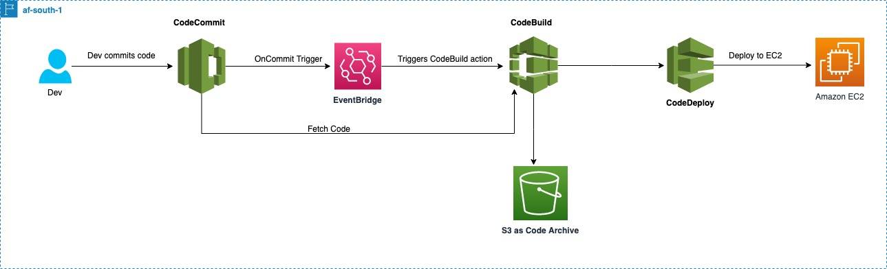

# Invisible Pipeline in regions where CoePipeline is not supported yet !

AWS CodePipeline is a continuous delivery orchestration product of DevOps suite of Amazon Web Services which integrates vast variety of sources ( like Git, Storage solutions etc ), continuous integration products and services from AWS, partners and open source products alike into an end-to-end workflow service for fast application and infrastructure deployments.

However, AWS CodePipeline is not supported in all the AWS regions and it becomes important to have an invisible orchestrator connecting other CI and CD services. This pattern will showcase how to implement an end-to-end workflow pipeline where the AWS CodePipeline is not yet supported using existing AWS CI and CD services like AWS CodeCommit, AWS CodeBuild and AWS CodeDeploy.


## Target technology stack


A developer will push the AWS CodeDeploy config files (also called deployment lifecycle hook scripts) to the Git repository (AWS CodeCommit). Please check above table for more information on the repository name. AWS CodeBuild is auto triggered internally by Amazon EventBridge rule.


AWS CodeDeploy config files are fetched from AWS CodeCommit which is the source/init stage of the pipeline and transferred to continuous integration service AWS CodeBuild. 


The next phase (AWS CodeBuild) is to  -  

           (a)  Download the application source code TAR file (name can be configured via AWS Systems Manager parameter store)

           (b)  Download the AWS CodeDeploy config files

           (c)  Create combined archive of Application source code and AWS CodeDeploy config files specific to application type, and

           (d)  Trigger AWS CodeDeploy deployment using the combined archive.

Below is the workflow diagram of pipeline created in an un-supported region of AWS CodePipeline like af-south-1 (capetown)




## SETUP - Setup AWS CDK

Clone the repository in your local system -

https://github.com/aws-samples/invisible-codepipeline-unsupported-regions

Go to cdk.json and provide default values (check sample below) -

    "pipeline_account":"XXXXXXXXXXXX",

    "pipeline_region":"us-west-2",

    "repo_name": "app-dev-repo",

    "ec2_tag_key": "test-vm",

    "configName" : "cbdeployconfig",

    "deploymentGroupName": "cbdeploygroup",

    "applicationName" : "cbdeployapplication",

    "projectName" : "CodeBuildProject"


Where, 
pipeline_account is the AWS Account where the pipeline will be built.
pipeline_region is the AWS region where the pipeline will be built.
repo_name is the name of the AWS CodeCommit respository
ec2_tag_key is the tag attached to the EC2 instance
configName is the AWS CodeDeploy Config Name
deploymentGroupName is the AWS CodeDeploy Config Group Name
applicationName is the AWS CodeDeploy Application Name
projectName is the AWS CodeBuild Project Name


Run below commands to initialize and build the solution 

```npm i aws-cdk-lib```

```npm run build```

```cdk synth```

```cdk deploy```


## SETUP - Setup th epipeline instructions and test the solution

Clone the AWS CodeCommit repository called app-dev-repo to setup the CICD for the application as below 

git clone https://git-codecommit.XXXXXXXX.amazonaws.com/v1/repos/app-dev-repo

NOTE: Repository name and region will be different based on the values provided in cdk.json


In the directory “CodeDeploy_Files“, there are sample files to instruct AWS CodeDeploy to deploy the application. The directory contains appspec.yml which is AWS CodeDeploy config file containing AWS CodeDeploy hooks to control the flow of application deployments. 

Other sample files include index.html, start_server.sh, stop_server.sh and install_dependencies.sh which are sample files for updating website hosted on Apache. This is only a sample and this solution can be used to deploy any type/kind of applications/softwares.

Once the files are pushed to AWS CodeCommit repository, the invisible pipeline is triggered automatically. Please check the results of individual phased like AWS CodeBuild and AWS CodeDeploy for the deployment results in AWS Console.


